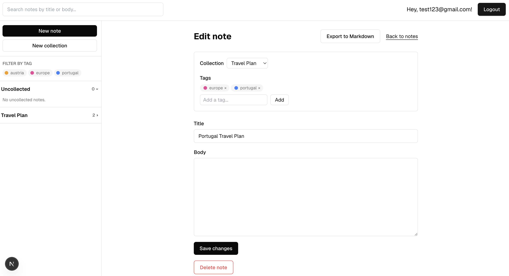

# Notes App

A simple, private notes app. Sign in, write notes, organize them into
collections, tag them, and export any note as a Markdown file. Every note
you create is only ever visible to you.

## What you can do

- Sign up and sign in
- Create, edit, and delete notes
- Group notes into collections, and rename a collection just by clicking its name
- Add color-coded tags to notes, and filter notes by tag
- Search notes by title or body
- Export any note to a `.md` file you can download to your computer

## Screenshot



## Running it locally

You'll need [Node.js](https://nodejs.org) installed, and a free
[Supabase](https://supabase.com) account (Supabase is the database this app
saves your notes to).

1. **Install dependencies**

   ```bash
   npm install
   ```

2. **Set up your environment variables.** Create a file named `.env.local`
   in the project's root folder with this content:

   ```
   NEXT_PUBLIC_SUPABASE_URL=your-project-url
   NEXT_PUBLIC_SUPABASE_PUBLISHABLE_KEY=your-publishable-key
   ```

   To find these values: open your project on the
   [Supabase dashboard](https://supabase.com/dashboard), go to
   **Settings → API**, and copy the **Project URL** and the
   **anon / publishable key** into the file above.

3. **Start the app**

   ```bash
   npm run dev
   ```

4. Open [http://localhost:3000](http://localhost:3000) in your browser
   (if that port is already in use, the terminal will tell you which port
   it picked instead, e.g. `3001`).

## Optional tasks delivered

**Export to Markdown** — every note has an "Export to Markdown" button that
downloads the note as a `.md` file.

Built on its own branch and shipped via pull request:
[#12 Add export-to-markdown button on the note page](https://github.com/pmiecius1/sprint-two/pull/12)

**Loading states** - Show a skeleton or spinner while documents are being fetched from Supabase, so the page never flashes a blank list.
